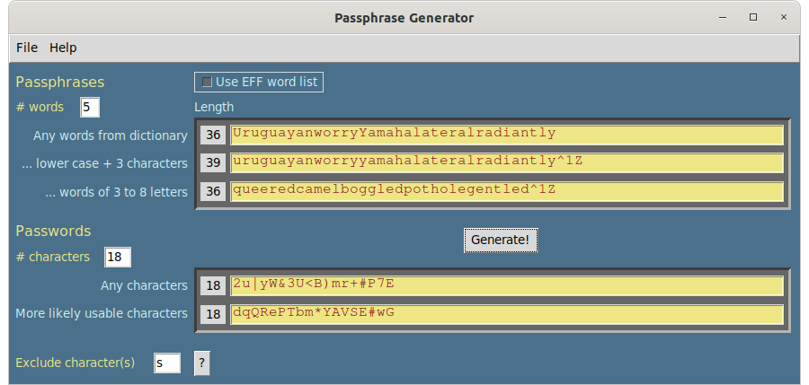

# Passphrases Project
Python GUI scripts and cross-platform executables to easily make secure passphrases and passwords.

A potential problem with some on-line password and passphrase generators is that they are on-line. Here is something that can be run locally and privately either as a standalone program on **Windows** and **MacOS** or as a Python script from a Terminal window in **Windows**, **MacOS**, or **Linux**. 

Words and character strings are randomized with Python's Random class using a random seed: random.Random(random.random()). For more information, see https://docs.python.org/3/library/random.html#random.random

The different pass-strings generated provide options for compliance with a range of website and application requirements. 
Suggestions for improvement are welcome, especially ideas to access the system dictionary on Windows.



#### Requirements
Developed with Python 3.8-3.9, under Ubuntu 20.04, Windows 10, and MacOS 10.13.6 & 11.1. The standalone programs do not need Python installation. 
Running from the command line requires Python 3.6 or later, preferably 3.7 or later. A recent tkinter graphics module of Python is required, which is included in Python 3.7+; earlier versions will require installation of Tk/Tcl. Recent Python packages can be downloaded from https://www.python.org/downloads/.

## Usage
To get started, download the repository package by clicking on the Code download button and select the Download ZIP option, or use git commands if you are comfortable with that. Unzipping (extracting) the zip file will create a passphrases-master directory. What to do with individual files is outlined below.

### GUI Implementations
#### passphrase.py
Running the script brings up an interactive graphics window to generate passphrases and password strings. On **MacOS** and **Linux** there is an option to create passphrases using either the system dictionary or the Electronic Frontier Foundation's long wordlist. On **Windows**, only the EFF word list is used. The number of words used for each option can be seen from the pulldown menu: `Help -> What are passphrases?`. The passphrase.py script is launched from a Terminal command line. 

For **Windows**, the file `eff_large_wordlist.txt`, included in this distribution, must be kept in the passphrases-master folder. Launching the program by double-clicking on the passphrase.py icon may work if .py is in your PATH list. Otherwise, launch a Terminal window opened from the passphrases-master folder and enter the command ```python3 passphrase.py``` or ```python passphrase.py``` or ```py passphrase.py```, depending on your system environment. 

For **Linux** or **MacOS**, the EFF wordlist file also needs to be in the passphrases-master folder, but its use for generating passphrases is optional. The default source for words is your system dictionary. Launch the script from a Terminal window opened within the passphrases-master folder using the command 
```python3 ./passphrase.py``` or ```./passphrase.py```  On **MacOS**, a Python Launcher is bundled with some Python installations and can be configured to run passphrase.py by double-clicking on it.

On Ubuntu **Linux** systems, you can use the included Desktop Launcher file to open the program with a double-click. After downloading the repository, copy or move the `Passphrase.desktop` file to your Desktop, then open with a text editor to change the <you the user> component of the path names to your username. Make any other path changes necessary if you do not keep the passphrases-master folder in your user home directory. Once the paths are set, right click the desktop icon and select Allow Launching, then double-click to execute `passphrase.py`.

### Stand-alone versions (no Python installation needed!)
#### Passphrase.app - MacOS
A **MacOS** standalone of passphrase.py. Download an extract the GitHub distribution package as outlined above. Inside the passphrases-master folder, `Passphrase.app.zip`. Unzip that (just double click and follow prompts) to install the `Passphrase.app`, which you can place where ever you like. The first time you double-click on it, however, you will most likely get a message saying it can't be used; simply go into System Preferences > Security & Privacy > General and allow the app to open. It doesn't open initially because it was not downloaded from the Apple Store or from a recognized Apple developer. `Passphrase.app` was created with `py2app` from https://pypi.org/project/py2app/

#### Passphrase.exe - Windows
A **Windows** standalone of passphrase.py. Download an extract the GitHub distribution package as outlined above. Inside the passphrases-master folder is `Passphrase_win.zip`, an archived distributable folder of files necessary for running the Windows executable. Extract All for that ZIP file, then within the extracted Passphrase_win folder is the executable, `Passphrase.exe` (the .exe extension may not show, depending on your system view settings). Double-click `Passphrase.exe` to launch. You will likely first need to permit Windows to open it: from the pop-up warning, click on "more info", then follow the prompts to open the program. When the program window opens it will also open a Terminal console window, which can be ignored, although if something goes wrong with program execution, messages will appear there. The `Passphrase_win` folder can be placed anywhere, but you may want to create an alias of `Passphrase.exe` to move to a convenient location for easy access. The `Passphrase_win` distributable was created with `py2exe` from https://pypi.org/project/py2exe/

### Python script with Terminal only output
The original Python script, `pypassphrase` (79 lines!), only produces passphrases and only runs in a Terminal window under Linux and MacOS. It uses only the system dictionary of those systems from which to randomly draw words. It does not work under Windows because of no access to that system's dictionary. To execute, you may need to download or update to Python 3.6 or later. Run the command line as outlined above for `passphrase.py`.

