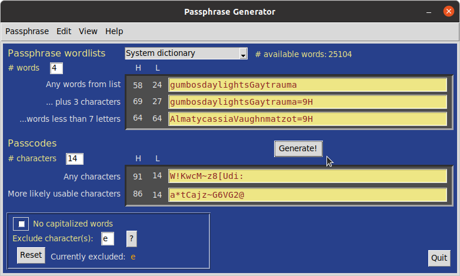

# Passphrases Project


Python GUI scripts and cross-platform executables to easily make secure passphrases and passcodes.

A potential problem with some on-line passcode and passphrase generators is that they are on-line. Here is something that can be run locally and privately either as a standalone program on **Windows** and **MacOS** or as a Python script from a Terminal window in **Windows**, **MacOS**, or **Linux**. 

Words and character strings are randomized with Python's Random class using a random seed: random.Random(random.random()). For more information, see https://docsthon.org/3/library/random.html#random.random

The different pass-strings generated provide options for compliance with a range of website and application requirements. 
Suggestions for improvement are welcome, especially ideas to access the system dictionary on Windows.



#### Requirements
Developed with Python 3.8-3.9, under Ubuntu 20.04, Windows 10, and MacOS 10.13.6 & 11.1. The standalone programs do not need Python installation. 
Running from the command line requires Python 3.6 or later, preferably 3.7 or later. A recent tkinter graphics module of Python is required, which is included in Python 3.7+; earlier versions will require installation of Tk/Tcl. Recent Python packages can be downloaded from https://wwwthon.org/downloads/.

## Usage
To get started, download the repository package by clicking on the Code download button and select the Download ZIP option, or use git commands if you are comfortable with that. Unzipping (extracting) the zip file will create a passphrases-master directory. Once the program is launched (see below), click Generate! to make passphrases and passcodes. Results can be copied. Passphrase and passcode lengths are set by the user. Usage details for different operating systems are outlined below.

Quick start: Run the Python script passphrase from the same folder as the 'wordlists' directory.

### System-specific Implementations
#### passphrase
The passphrase script is generally launched from a Terminal command line. Running the script brings up an interactive graphics window to generate passphrases and passcode strings. On **MacOS** and **Linux** there is an option to create passphrases using either the system dictionary or different wordlists. On **Windows**, only the system dictionary is not available. The number of words available for each wordlist can be seen to the right of the selected wordlist and from the pulldown menu: `Help -> What's going on here?`.

For **Windows**, the folder, `wordlists`, included in this distribution, must be kept in the passphrase-generate-master folder. Launch a Terminal window opened from the passphrases-master folder and enter the command ```python3 passphrase``` or ```python passphrase``` or ```py passphrase```, depending on your system environment. 

For **Linux** or **MacOS**, the `wordlists` directory also needs to be in the passphrases-master folder, but its use for generating passphrases is optional. The default source for words is your system dictionary. Launch the script from a Terminal window opened within the passphrases-master folder using the command 
```python3 ./passphrase``` or ```./passphrase```  On **MacOS**, a Python Launcher is bundled with some Python installations and can be configured to run passphrase by double-clicking on it.

### Stand-alone versions (no Python installation needed!)
#### Passphrase.app - MacOS
A **MacOS** standalone of passphrase. Download an extract the GitHub distribution package as outlined above. Inside passphrase-generate-master/Standalone_distributables folder is `Passphrase_mac.app.zip`. Unzip that (just double click and follow the prompts) to install the `Passphrase.app`, which you can place where you like. Alternatively, the distributable app can  be downloaded directly from https://github.com/csecht/passphrase-generate/raw/master/Standalone_distributables/Passphrase_mac.app.zip. `Passphrase.app` was created with `py2app` from https://pypi.org/project/py2app/

The first time you try to open the app, however, you will get a message saying it can't be opened. Click "Cancel", go into System Preferences > Security & Privacy, click the "Open anyway" button, then "Open". It does not open initially because it was not downloaded from the Apple Store or from a recognized Apple developer. 

The process of opening apps from unrecognized Apple developers can be somewhat streamlined by re-establishing (as of MacOS Sierra) the "Allow apps downloaded from: Anywhere" option in Security & Preferences. Do this with the following command line in the Terminal: `sudo spctl --master-disable`. Using the Finder 'Open' command directly on the unzipped app in its folder, can also somewhat reduce the hassle of navigating through System Preferences; once that is done, then any alias to the app should work smoothly. With any of these "fixes", you will, initially and appropriately, be prompted by the MacOS Gatekeeper to open the app. 

#### Passphrase.exe - Windows
A **Windows** standalone of passphrase. Download an extract the GitHub distribution package as outlined above. Inside the `passphrase-generate-master/Standalone_distributables` folder is `Passphrase_win.zip`, an archived folder of files necessary for running the Windows executable. This distributable archive can be downloaded directly from  https://github.com/csecht/passphrase-generate/raw/master/Standalone_distributables/Passphrase_win.zip. Select Extract All for that ZIP file. Within the extracted Passphrase_win folder is the executable, `Passphrase.exe` (the .exe extension may not show, depending on your system view settings). Double-click `Passphrase.exe` to launch. You will likely first need to permit Windows to open it: from the pop-up warning, click on "more info", then follow the prompts to open the program. The `Passphrase` folder can be placed anywhere, but you may want to create an alias of `Passphrase.exe` and move it to a convenient location for easy access. The `Passphrase_win` distributable was created with `py2exe` from https://pypi.org/project/py2exe/   

Instructions for how to create your own stand-alone from the passphrase script are in Standalone_distributables/setup_README.txt.

## Wordlist sources:
Optional wordlists were derived from texts obtained from these sites:
- https://www.gutenberg.org
- https://www.archives.gov/founding-docs/constitution-transcript
- https://www.eff.org/files/2016/07/18/eff_large_wordlist.txt

The `parser` script from https://github.com/csecht/make_wordlist was used to create the custom wordlists used here. That repository also includes source text files for these wordlists.

## Tips:
The program places no limits on the length of pass-strings, though your system memory might. The window can be dragged to view longer results up to a limit; results exceeding that limit can still be copied and pasted.

## Known issues:
In MacOS, using F1 to increase font size in any pop-up window inserts a "?"/unknown character in the text when cursor in in the text field. 

## Development plans:
- Use Windows system dictionary
- Make Debian package
- Make Windows installer
